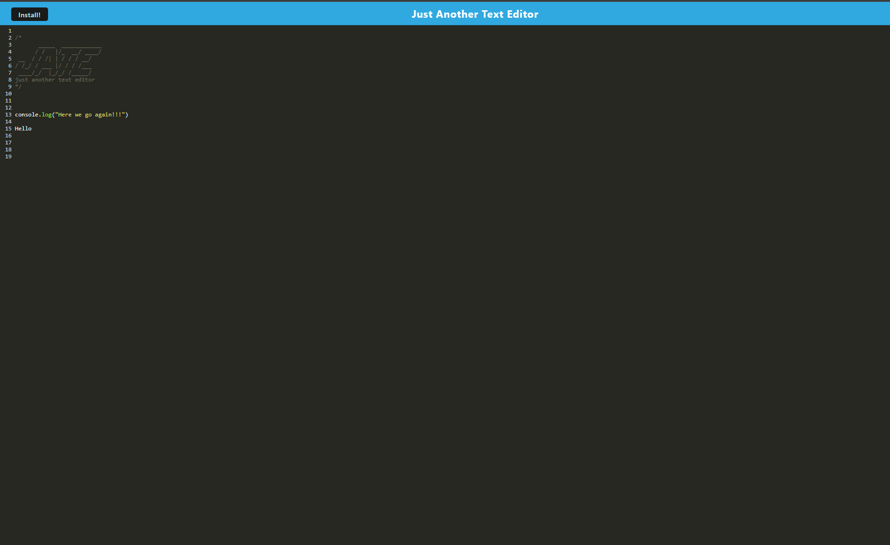
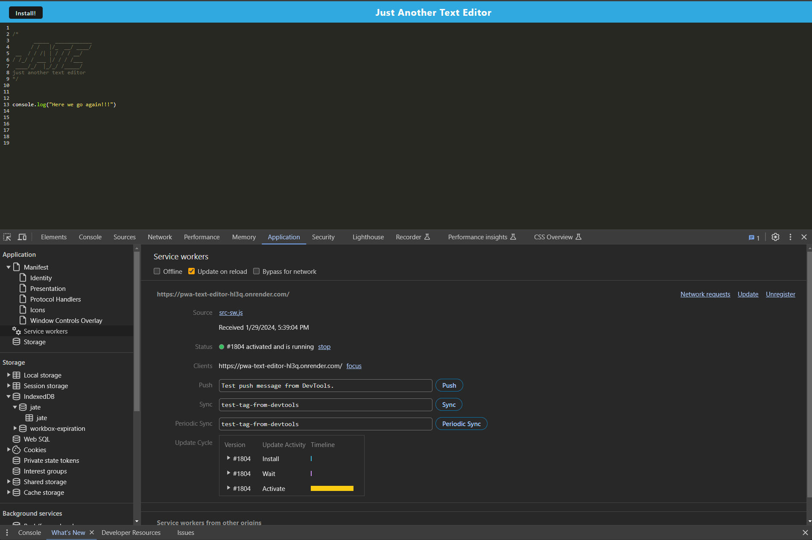
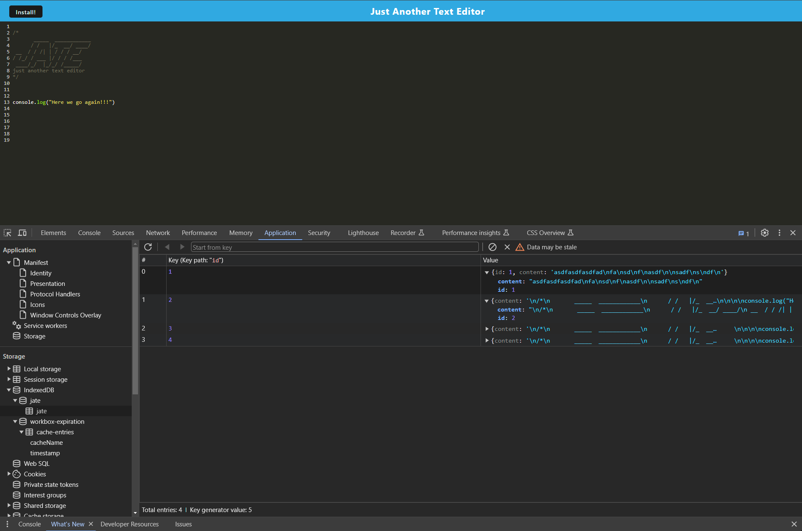

# Module 19 Challenge: Progressive Web Applications (PWA): Text Editor

<p align="center">
  
</p>

## Description

I was task with modifying a starter code provided by the U of M to enable the app to function offline, establishing a database for data storage, and provide users the ability to install the application onto their devices.


Click on the link for deployed application on Render:
[(PWA): Progressive Web Applications (PWA)](https://pwa-text-editor-hl3q.onrender.com)

Screen Shots:





## Table of Contents
1. [Installation](#installation)
2. [Technologies](#technologies)
3. [Usage](#usage)
4. [Credit](#credit)
5. [Contribution](#contribution)
6. [License](#license)
7. [Contact](#contact)

## Installation
Make sure that you have Node.js install, if you do not have node.js, you can visit [Node.js website](https://nodejs.org/en).

In your terminal type in:

```
npm install          
```
This will install all the dependencies in package.json files


## Technologies

<p align="center">
  
  
  
  

</p>

## Usage

From the terminal type in `npm run start` from the root of the directory. 

Navaigate to the `client` folder expand it and click on `dist` folder , from `dist` you would want to located `index.html`, open it in your brower.

## Credit

Starter code provided by the U of M fullstack boot camp.

## Contribution

Created for Module 19 Challege of the U of M full stack boot camp. 

## License

This project is licensed under the MIT License.

## Contact

 * Email: xiongxeng@gmail.com
 * Github: http://github.com/freeway9527

